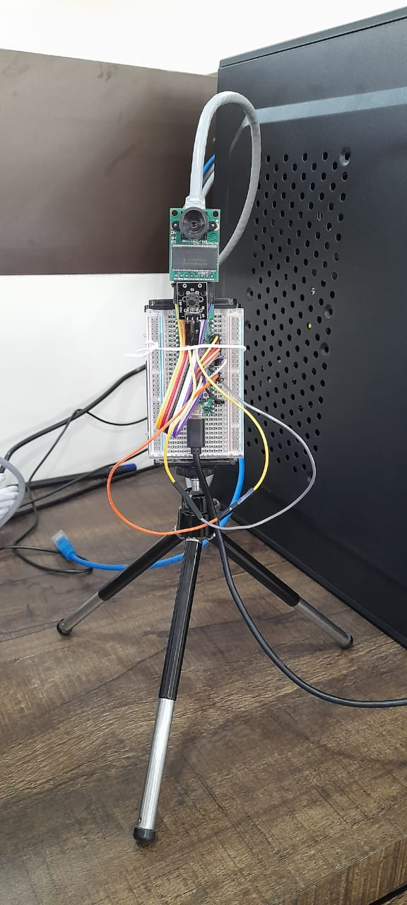
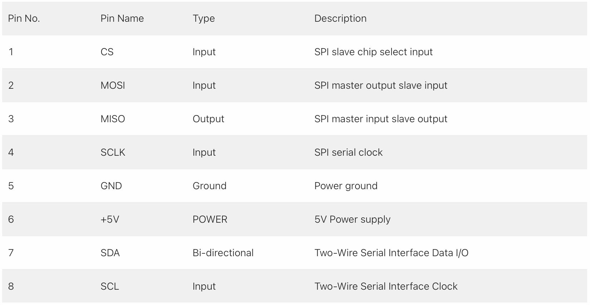

<body>
	<h1>Flask Server for Door Security System</h1>
	

This is a Flask web server that interfaces with an ArduCam camera module and performs facial recognition on captured images. The server is integrated with Telegram, MQTT, and OpenCV libraries for image processing and messaging capabilities. Once the door bell has been pressed, notification has been sent to telegram bot of the user “Someone is at the door” then camera module captures the snapshot, which has been sent to program which is used to recognised the face of the visitor, and then the snapshot of the visitor and the name of visitor (if it’s image is in database) will be sent to user’s telegram bot.

<h2>Flow of working of the project</h2>

  <h2>Dependencies</h2>
<ul>
	<li>Python 3.7+</li>
	<li>OpenCV</li>
	<li>Flask</li>
	<li>Flask-WTF</li>
	<li>Flask-Uploads</li>
	<li>Telegram API</li>
	<li>Paho MQTT</li>
	<li>SimpleFacerec</li>
</ul>

<h2>Circuit Diagram</h2>
<h3> How to configure SPI for ArduCam Mini 2MP Plus - SPI Camera Module on W5100S-EVB-Pico board</h3>

**WIZnet W5100S-EVB-Pico**

The WIZnet W5100S-EVB-Pico board uses default SPI0 for the internal ethernet chip W5100S. It uses GPIO pin 21-22 and 24-27.

The ArduCam provides <a href="https://www.arducam.com/docs/pico/arducam-camera-module-for-raspberry-pi-pico/spi-camera-for-raspberry-pi-pico/">a document and source codes "SPI Camera for Raspberry Pi Pico"</a> and it also uses SPI0. To avoid the confliction, this project uses SPI1 for the ArduCam OV2640 Module.

**ArduCam Mini 2MP Plus - SPI Camera Module - Pin Definition**

ArduCam OV2640 Module requires CS, MOSI, MISO, SCLK pins for SPI connection, and SDA, SCL pins for I2C connection. This project modified the source code of ArduCam to use SPI1.

**Pico pin configuration for ArduCam OV2640**

1. CS --> GPIO 13
2. MOSI --> GPIO 11
3. MISO --> GPIO 12
4. SCLK --> GPIO 10
5. SDA --> GPIO 8
6. SCL --> GPIO 9
<h2>Getting Started</h2>
<ol>
	<li>Clone this repository.</li>
	<li>Set up a Telegram bot and obtain its API token. Replace the BOT_TOKEN variable in main.py with your token.</li>
	<li>Modify the names list in app.py with the names of the people you want to recognize.</li>
	<li>Start the Flask server using python main.py.</li>
	<li>Open your web browser and navigate to http://localhost:1066.</li>
	<li>Upload an image of a person in front of the door to trigger face recognition.</li>
</ol>

<h2>Component required</h2>
<ol>
<li>Hardware IDE</li>
  <ul>
    <li>WIZnet W5100S-EVB-Pico</li>
    <li>Arducam Mini 2MP Plus – OV2640 SPI Camera Module</li>
    <li>Push button</li>
    <li>Jumper wires</li>
    <li>Tripod stand</li>
 </ul>
<li>Software IDE</li>
<ul>
  <li>WIZnet W5100S-EVB-Pico</li>
  <li>Arducam Mini 2MP Plus – OV2640 SPI Camera Module</li>
  <li>Push button</li>
  <li>Jumper wires</li>
  <li>Tripod stand</li>
 </ul>
</ol>

<h2>Methodology</h2>
  
The program is designed to implement a home security system using Flask web framework, OpenCV for face recognition, Telegram API for notification and MQTT protocol for communication between devices. The program contains two functions, face_recognition() and mesaage_handler(), and a Flask web application. The face_recognition() function is used for recognizing the faces in the images by using the OpenCV library. This function takes the path of the image file as input and returns the name of the person identified in the image. The mesaage_handler() function is used for handling incoming messages from Telegram. This function receives messages and sends them to a MQTT broker.
  The Flask web application allows users to upload images to the server. When an image is uploaded, the program detects if someone is at the door by checking the image for any known faces. If a known face is detected, the program sends a notification to the user through Telegram.To achieve this functionality, the program uses a separate thread for continuously checking if an image has been uploaded, and if so, runs the face recognition algorithm on the image. If a face is detected, a notification is sent through Telegram.

<h2>Code Explaination</h2>
<ol>

This code is for creating a Flask web server that can receive a JPEG image file through POST request, perform face recognition using the SimpleFacerec library, and send a notification to a Telegram bot with the result. The code also uses MQTT protocol to publish and subscribe to topics for home automation purposes.
The necessary libraries are imported [line: 1-14]. Then, an instance of the Flask class is created with the name app [line: 19]. The photos variable is defined as an instance of UploadSet that accepts image files. The path for uploaded images is set to "static/img". The configure_uploads function is called with the app instance and photos to configure the upload directory [line: 21-24].

The face_recognition() function loads pre-encoded images of known faces from a specified directory using the SimpleFacerec library. Then it reads the specified image file and performs face recognition on the image using the loaded encoding images. The function returns the location and names of the detected faces.[line: 31-36]
The func() function is continuously running in a separate thread, waiting for the flag variable to be set to True. Once the flag is True, the function reads the image file from the specified directory, performs face recognition using the face_recognition() function, sends a notification to the Telegram bot with the result, and sets the flag back to False. [line: 48-77]
The mesaage_handler() function is the handler for incoming messages from the Telegram bot. It subscribes to a specified topic using MQTT protocol and publishes a message with the received text to the topic.[line: 39-45]
Finally, the main function of the code is the upload() function, which is the handler for the POST request. The function first checks if the content type of the request is image/jpeg, then saves the received image file to the specified directory. After saving the file, it sets the flag variable to True, indicating that a new image has been received and it's time to perform face recognition.[line: 81-109]
Finally, the code sets up a Flask app, configures file uploads, and starts the Flask app with the app.run() method. It also starts a separate thread for the func() function and starts the Telegram bot with the main() function.
The if _name_ == '_main_': block starts the Flask application on 0.0.0.0 on port 1066 [line: 124-128] and starts the func() as a separate thread. [line: 125-126]

</ol>

<h2>Additional Notes</h2>
<ul>
	<li>When a face is detected, a Telegram message is sent to the user with the name of the recognized person (if found).</li>
  <li>This program also supports sending and receiving MQTT messages. You can modify the mesaage_handler function in app.py to handle incoming messages as needed.</li>
  </ul>

<h2>Reference</h2>
<ul>
	<li>Whttps://www.hackster.io/innovation4x/webcamserver-arducam-ov2640-module-wiznet-evb-pico-73ceae</li>
  <li>https://api.telegram.org/bot6031744449:AAFoNG8OKbcDCCT2saMyVj6N5r2WoNnFeMk/getUpdates</li>
  <li>https://www.geeksforgeeks.org/send-message-to-telegram-user-using-python/</li>
  <li>https://mqtt.org/</li>
</ul>
